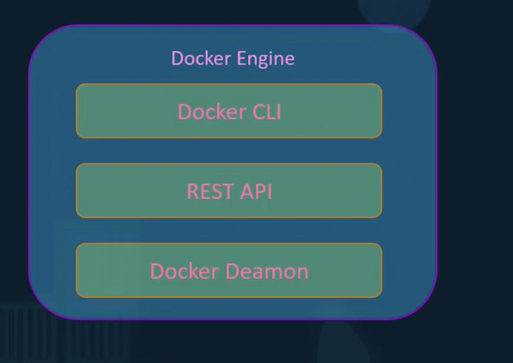

# Docker 

Why need Docker?  
>Need application running in various system and different OS so there is compatibility issue.
 
>Any new developer have to set all application again and according to his/her own Os and system, so face issues again and again.
 
>Need something to build, compose and deploy so it will be easy fro running application.

>Docker has container in it so all other person needs is Docker installed in the system and have the container image and can run it.Uses LXC container(Many types).

## Basics
>OS Kernel above it have software to interact with it.Docker uses this underlying kernel.

>Container vs VM's: VM's has hypervisor and each have it's os as in their own machines.Docker use same os just .Both can be used together as well.

>Most basic softwares have their image available on Docker.Just need to use
```
    docker run someSoftware
    >such as ansible,mongodb,redis,nodejs etc.
```

>Container vs Image: Image is like a template, can be used to create one or more containers.Containers are tunning application.

>Earlier developers used to give application build and infor of how to set it up and now they can just build docker image along with devops to deploy it efficiently and it runs same everywhere.

## Installation
>Docker has two version community and Enterprise.

>Linux can install and run it.

>Windows can install VM's and use linux there and install it.You also have docker desktop for it.

>mac : similar to windows.

>hub.docker.com : basic place to get base images for many software

```
    docker run "image name"
```
Use above to test docker installation and run images.

## Basic Docker Commands

>To run a container from an image
```
    docker run imageName

    add -d after run to run this in background, to redo it use docker attach contaienr id
```
when running an image first time it ge's downloaded and then used.So subsequest runs same image can be used.

>To list containers currently running
```
    docker ps
```
>To list all containers historically
```
    docker ps -a
```
>To stop a running container
```
    docker stop "containerName/containerId"
```
>To remove container permanently(as all container are saved,including stopped)
```
    docker rm "containerName/containerId" 
```
>To see all images downloaded locally
```
    docker images
```
>To remove an image(All dependent running containers must be stopepd first)
```
    docker rmi "imageName"
```
>To pull an image(docker run runs containers as well)
```
    docker pull image
```

```
    docker run ubuntu

when you run an ubuntu container it usually exists as container exits whenever a process is stopped.

    docker run ubuntu sleep 5

it will get exited after more than 5 seconds
``` 
> docker exec "containerId" "command"...... [runs a new command in running container]

>docker run -it "anyOS" bash // so it will run and give access to bash and keep it running

## Some Advance commands/Features
>docker run image:version/tag  //run a particular version of image if not mentioned default is latest

> To read Logs
```
    docker logs "containerName"
```

>To list particular container's details
```
    docker inspect "containerName"
```
>docker run -d ...... //for running in background

>docker attach "containerId" //for attaching that process again in foreground

> docker run -p localhost's-port:application port // now you can access from localHost:port given above

>docker run  ....... -v root/myDirectory:/var/applicationDataDocker //to persist data in localhost's myDirectory and can be used for similar images's data like some config and dependency etc

## Create your own Image
Typically you need a base OS and then need project related language and libraries.Then also needs to install dependecies for that language like from pip for python and maven from java.We copy source to a particular folder and then run it.

```
    //ALL IN CAPITAL LETTER ARE INSTRUCTIONS
    FROM ubuntu   //Base OS,All dockerFile must Start from instructions

    RUN apt-get update
    RUN apt-get install python   //Installing dependecies

    RUN pip install flask
    RUN pip install flask-mysql //Installing dependencies

    COPY sourceFile.app /opt/source-code //copy sourcecode

    ENTRYPOINT FLASK_APP=/opt/source-code/app.py flask run //specify entrypoint

```
Use docker history imageName //to see all layers installed like above steps

>You can contanerize everything, so much easier

```
    docker build . //for building from dockerfile your own image,can give tag etc, go cd to you dockerfile
```

```
    docker push myImage // should login first,have tags etc
```
> CMD [someCommands] : It will get executed at start
>RUNTIME [someCommad] : It will get executed at start and can add something as well at commandLine
> can override with --entrypoint as well

### Docker Environment Variables

>can declare env varaibles to be used at runtime and can be given value when using it
>add -e in thr run command to give env variable the value

## Docker compose
>used for running/starting compex application containing various running image it's in yml format
```
    docker-compose up //to run this dokcer compose works different remember -
```

```
    docker run --link  internalVariables:imageName  //to link various containers like db to backend app, older concept maybe removed
```

>we can create .yml file with various images theri naming and various attributes to be given

>Now there is various versions of .yml docker compose.In veersion 2 doesn't requires links, all can be inter connected and it allows to add depends_on so as to assign dependecy and first the main container is started then the dependent one.Can create your own network and assign particular network to it
Version 3 has docker swarm support.

> In Linux docker compose has to be manually downloaded , but already included in mac windows along with docker desktop

basic/older yaml file
```
    containerName:
        image: image1

    containerName2:
        image:image1
        ports:
            - localPort:imagePort
        links:
            -someContainerNameYouWantThisToLinkTo
            -anotherLink

//links not used now we can create network so all in that network can communicate

```

```
//can giveVersion at top/maybe older Practice
services:
  vote:
    build: ./vote
    # use python rather than gunicorn for local dev
    command: python app.py
    depends_on:
      redis:
        condition: service_healthy
    healthcheck: 
      test: ["CMD", "curl", "-f", "http://localhost"]
      interval: 15s
      timeout: 5s
      retries: 3
      start_period: 10s
    volumes:
     - ./vote:/app
    ports:
      - "5000:80"
    networks:
      - front-tier
      - back-tier

  result:
    build: ./result
    # use nodemon rather than node for local dev
    entrypoint: nodemon server.js
    depends_on:
      db:
        condition: service_healthy 
    volumes:
      - ./result:/app
    ports:
      - "5001:80"
      - "5858:5858"
    networks:
      - front-tier
      - back-tier

  worker:
    build:
      context: ./worker
    depends_on:
      redis:
        condition: service_healthy 
      db:
        condition: service_healthy 
    networks:
      - back-tier

  redis:
    image: redis:alpine
    volumes:
      - "./healthchecks:/healthchecks"
    healthcheck:
      test: /healthchecks/redis.sh
      interval: "5s"
    networks:
      - back-tier

  db:
    image: postgres:15-alpine
    environment:
      POSTGRES_USER: "postgres"
      POSTGRES_PASSWORD: "postgres"
    volumes:
      - "db-data:/var/lib/postgresql/data"
      - "./healthchecks:/healthchecks"
    healthcheck:
      test: /healthchecks/postgres.sh
      interval: "5s"
    networks:
      - back-tier

  # this service runs once to seed the database with votes
  # it won't run unless you specify the "seed" profile
  # docker compose --profile seed up -d
  seed:
    build: ./seed-data
    profiles: ["seed"]
    depends_on:
      vote:
        condition: service_healthy 
    networks:
      - front-tier
    restart: "no"

volumes:
  db-data:

networks:
  front-tier:
  back-tier:

//Example of docker-compose file
```

**Don't Use Tab in compose file and remember to check yaml format**

## Docker Engine,Storage

<!--  -->


- Docker Daemon : BackGround Process,manages docker objects such as images containers etc 
- Rest API : Interface to talk to server
- Dokcer cli : Command line, it uses rest API to contact with daemon.Can be on remote system too, and connect remotly -H=""

> Docker uses namespaces to isolate the containers
> we can restrict and limit the amount of resources we want to allow a container to use, give docker run --cpus and --memory tag for that

> File system when docker gets installed in our system
- /var/lib/docker
    - aufs
    - containers
    - images
    - volumes

> Docker containers data is volatile but you can add a persistent storage to save the data, can create beforehand or at the command run time it will create, 

```
    docker run -v myFolder:/var/lib/dockerVolume anyDb 
    
    // this data can be used to create another container and it will again get the data from myFolder
    //uses storage drivers for that docker uses default best one according to os you can change if that doesn't suit
```

## Docker Networking

> Docker creates 3 network by default
- Docker Bridge // created by docker for all docker containers to communicate
- Docker None // to keep isolated
- Docker Host //our host

```
-- network netName , this tag in run command to attach to a network
docker network ls //list all network
docker network inspect netName // to get infor of that network

can do various advance stuff with network
```

## Docker Registry
> Place where docker images are stored.Image gets pulled from here, there is central dokcer registry.

```
     docker run image
i.e. docker run image/image 
                {user/account}/{image/repo}
    can create your own account as well.
    by default it uses central repo,
    there are many public reo as well. Can make repo private as well.
    You can create localhost registry as well so only your network can use this

    docker pull [server-addr/image-name]
```

## Container Orchestration
> What if you want to run various instances as when users increase, you have to manually monitor and increase decrease instance and check health of the running ones. and also the health of the host.

Container Orchestration is a solution for that.Some software available for this is:
- docker Swarm : easy to setup but not able to handle production grade.Uses master slave cluster, need various host.
- kubernetes : most popular, bit diffuclt and has various suppport.
- Mesos : hard to setup but has advance features

