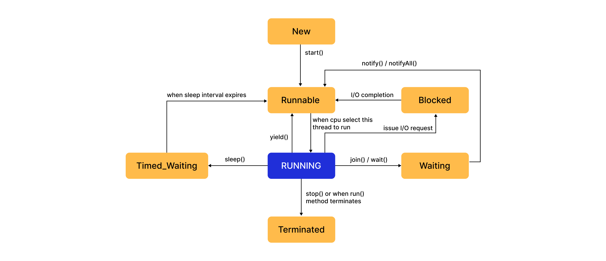
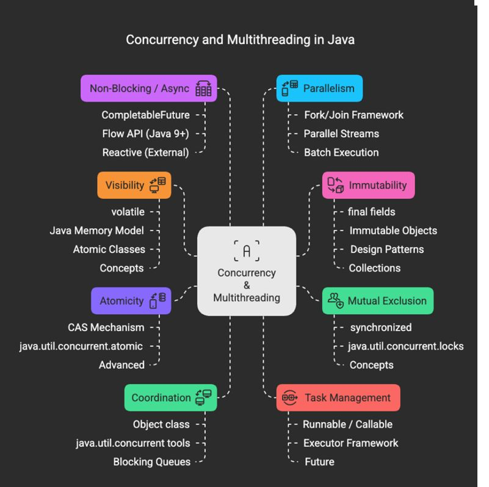

# Concurrency and Multithreading
## Threads
- Fundamental unit of execution allowing us to concurrent run a task
- Allowing us to use multicore cpu and enhance performance
- Process can be made up of threads according to need can be executed one by one or simultaneously
- Creating a thread is quicker and faster than process as thread has shared memory and other things
- One process crashed may not affect other process but a thread crashing brings down it's process
- Chrome tab are separate process so they take a lot of memory but not all tab crashes together.Game engines, video editors etc. are other examples
- Mobile apps, Ecommerce , music streaming uses threads usually for different purposes
### Key Features of Threads
- Concurrent Executions
- Resource Sharing : for faster communication and execution
- Lightweight
### Creating Threads in Java
1. Extending the thread : drawback extending so can't extend another class
    ```java
    class MyThread extends Thread{
        @Override
        public void run() {
    //        any code here
        }
    }
    class MainClass{
        psvm(){
            MyThread myThread = new MyThread();
            myThread.start();
    //        if two or more threads are created we can not be sure of order of execution 
        }
    }
    ```
2. Implementing the Runnable Interface : only difference is implementing other than extends, most probably this is in prod case but even this is not used in production as no one makes their own thread
    ```java
    class MyRunnable implements Runnable{
        @Override
        public void run() {
    //        any code here
        }
    }
    class MainClass{
        psvm(){
            AThreadCreation.MyRunnable myRunnable = new AThreadCreation.MyRunnable();
            MyThread myThread = new MyThread(myRunnable);
            myThread.start();
    //        if two or more threads are created we can not be sure of order of execution 
        }
    }
    ```
3. Callable : Introduced in java 5 more powerful alternative to runnable, because unlike runnable it can return the results, as run method has a void() return type
and can throw checked exception handling and work with Future Objects. Works well with executor service
    ```java
    class MyCallable implements Callable<String>{
    @Override
    public String call() throws Exception {
            return "RandomString"+ this.hashCode();
        }
    }
    public class Basic {
        public static void main(String[] args) throws Exception {
        //        MyCallable m = new MyCallable();
        //        System.out.println(m.call());
            try{
                    ExecutorService exec = Executors.newFixedThreadPool(5);
                    Future<String> future1 =  exec.submit(new MyCallable());
                    System.out.println(future1.get());//blocking call so main thread is stuck here, then next is reached
                    Future<String> future2 =  exec.submit(new MyCallable());
                    System.out.println(future2.get());
                    exec.shutdown();
            }catch (Exception e) {
              throw new RuntimeException(e);
           }
            
        }
    }
    ```
### Important things for Callable
- Need to override call method instead of run in case of extending thread and implementing runnable
- Runnable has run method to override , callable has call method to ovveride
- Now you can return something, has to declare type of callable <> when implmenting
- Developed to be used along with ExecutorService which return Future<CallableReturnType> of object
- allows exception to be throwed
> Checked exceptions enforce error handling at compile-time, while unchecked exceptions indicate programming mistakes that occur at runtime.
    ``` 
        Checked exception are the exception made compulsory by java to be handle during compile time as well so when they occur at run time they can be gracefullly handled
        examples include jdbcCOnnection(any DB connection, io connection)  so basically they are runtime ones but handled at compile time only
        Uncheked can ooccur at any point wherever your logic has a flaw like array index excpetion,null pointer etc
    ```
### Best Practices
- Use Runnable over Thread
- Keep synchronization minimal to avoid performance bottlenecks
- Handles interruption gracefully to ensure graceful thread termination
- Avoid thread starvation by balancing priorities and resource allocation
- Use higher level concurrency utilities or complex scenarios
- Thread safety can be achieved using
  - synchronization
  - immutable objects
  - concurrent collections
  - atomic variables
  - thread-local variables
### Other Points/Questions
- start() directly starts thread execution whereas run() has only code that need to be executed, and it will be executed on the current thread.
- so run() calling any time is no error/exception just will be executed on the current thread, calling thread.start() again will create IllegalThreadStateException
- Exception in run() doesn't get propagated to main thread, and it gets crashed
- sleep() vs wait() : sleep() for sometime without releasing lock(you come in home lock the door and sleep with door locked no wake on notify etc. only when interrupted ), in wait() releases the lock(and resources) and waits until some other thread invokes notify/notify ALL
- notify() wakes up one thread, notifyAll() wakes up all thread, and then they compete for acquiring lock 
- Can you use Callable with standard Thread object? No, but hack can use Callable object inside implementing class/interface, recommended executor service

## Thread Pools and Lifecycle
- 
### States
- NEW : Thread created but not start() is called
- RUNNABLE : Thread called start but no CPU allocation yet, ready-to-run
- RUNNING : CPU allocated and it's being executed
- BLOCKED : Inactive Trying to get some resource and then acquire lock
- WAITING  : No Timeout, waiting for other thread for performing some specific action(There is timed wait as well)
- TIMED WAITING : either timed sleep(keeps lock) or wait(lock release) or other similar ones
- TERMINATED : completed execution or as stopped can;t be restarted
### Thread Pools
- They are managed collection of reusable threads designed to execute threads concurrently
    ```
        ExecutorService executorService = Executors.newFixedThreadPool(5);
        executorService.submit(someThreadInstance);
  
        ....
        executorService.shutdown();
    ```
- Advantage in performance(reuse threads),resource management(fix no of thread created), and stability
- Various types of threadPools and methods are there
### Lifecycle for Thread Pool
- Pool Creation : pre created threads in new state, immediately goes to runnable state
- Task Execution : Task submitted any thread from pool will be in running state(and then wait blocked etc. according to flow) and then goes back to pool in Runnable state
  - Thread termination/interruption gets removed from pool and new is created until pool is filled
- Pool Shutdown : thread complete current task and gracefully terminate all threads
  - shutDownNow : immediately terminate
### Thread Poll Usage
- CPU intensive Task : newFixedThreadPool, keep size which can be used together, so not unnecessary thread.Fix tasks to be done repeatedly
- CachedThreadPool : create threads as and when needed , like IO need etc
- keep it simple use fixedThreadPoll most of the time, ThreadPoolExecutor has mixed custom property of both as well
- ThreadPoolExecutor
  - It will have some queue size and some timing and config to be given to have some fixed, some cached thread in pool
### Other Points/Questions
- After execution, it's task thread return to its thread pool in runnable state
- Big queue size of thread pool we can process large request, but it will take a toll on memory
- Shutdown does graceful end, shotDownNow terminates immediately all and return a list of thread that were interrupted, so any thread in any state to terminated
- Thread starvation is prevented by ThreadPool

## Thread Executors
- Provides powerful abstraction for thread management, simplifies creating, controlling and scheduling threads
- You just need to submit your task to executor, it will handle the execution 
- We can have scheduled execution as well for cron related jobs
- Executor also have monitoring things like active count, queue size etc
### Core Executor Interface and Classes
- Executor : Base interface , almost never gets used
- ExecutorService : Extends Executor with lifecycle management, so can give pool size
- ScheduledExecutorService : you can create pool for scheduling tasks
- ThreadPoolExecutor : you can give your configs so max/min thread, queue size, policy etc
- ScheduledThreadPoolExecutor 
- Executors : Factory class to create executor instances
  - has fixed, cache, scheduler and singleThreadExecutor 
### ExecutorService Methods
- executorService.execute() : no return anything you don't care, any exception we don't know
- executorService.submit() : return result in Future if you want to handle something
- invokeAll(tasks) : run all the tasks in parallel
### Some Question/IMPs
- Execute doesn't return anything so only accepts runnable tasks, submit both runnable and callable
- No shutdown of excService leads to memory leaks, exhaustion
- scheduleAtFixedRate is cron, scheduledAtFixedDelay is fix delay which is time between previous task execution and next
- Exceptions can be handled with future return type

## Thread Synchronization
- Allows to make sure a piece of code/resource is accessed by only single thread at a time
- Proper Thread Synchronization prevents race condition, Data corruption and ensures thread safety
- `synchronized` keyword to be used over a method or a block.
  - On nonstatic methods lock is acquired at same object level for and class level lock for static methods
- Allows fine-grained control over method/block
- `Volatile` Keyword : any change to any variable will be visible to any thread,used in flags/var used as some sort of simple lock
  - Read and written into the main memory for visibility and not cached, Can use in singleton pattern
  - Ordering is also ensured as visibility as there
  - Kind of light and fast version of synchronized over variable changes to be done, not recommended for PROD
  - Personally tested if thread sleeps or waits it's having data inaccuracy i.e. race condition
- `Atomic` variable support lock-free, thread-safe operations on single variables
  - as synchronized will be too much over a variable
  - for simple arithmetic operation on the variables
  - recommended for PROD
  - My guess is it only provides correct value after operations but can't be used for syncronizing like things

## Thread Communication
- wait(),notify(),notifyAll()
- wait() : release lock and wait for some condition to occur, like consumer waiting for message to be produced
- notify() : wakes up some thread for some condition
- notifyALL() : all waiting will be notified but only one will access
- these methods must be called from synchronized context(block or method) on the same object whose monitor thread is waiting on
- notify/notify wakes the other thread or all threads and, then they wait until a lock is not ready to be acquired

## Locks and Types of Locks
- Most always you will be using ReEntrant lock, synchronized provides us with basic locking facility
- java.util.concurrentLocks give more locks for more fine-grained and more specific use cases locks
- Benefits
  - have try,schedule,conditional lock feature
  - faster but more complex
- With locks a lot of things can go wrong, so you need to handle it
- Any unlocking should be done in finally block so any issue happens it unlocks at least
### ReEntrant Lock
- Thread holding the lock can reacquire it without causing nay issues
- ```
    ReentrantLock lock = new ReentrantLock();
    lock.lock();
    .....do your task etc......
    lock.unlock()
  ```
- reentrant locks can have deadlock if order of locking and circular dependecy is there
### ReEntrant ReadWriteLock
- Immense benefit, useful when need there are many who can read, and only one can write at a time and no reader during write time
- Basically on reading various reader can read, now can write, on writing only one can write and np reading at that time
- Divided into two parts, read lock and write lock, useful in increasing reading performance when there are many reader
### Questions/More Info
- synchronized is simple and slower, nothing to check locked or not etc., lock has more flexibility, we have tryLock(someTimeDuration) etc.
- synchronized lock unlocking is auto, in heer majorly in finally you unlock
- there are other lock as well but above thing are majorly should be used

## Semaphore
- Controlling how many threads can access some part, so locks(including synchronized) allow one thread at a time
- We have acquired and release parts which increment and decrement permit count, thread gets blocked if it can't get permit
### Types of Semaphore : Doesn't have particular types but people have categorized them
- Binary Semaphore : Has two state 0 or 1, so similar to mutex or lock, exclusive access, enforce mutual exclusion
- ```
    final Semaphore = new Semaphore(n);//n ==1 is binary similar to lock/mutex
  ```
- Counting Semaphore : n >=2 , any number is allowed, simultaneous access for this many thread accessing critical section
- Usages : Managing pool for access to resources, producer consumer pattern, controlling concurrency threads, enforcing mutex
### Questions/IMPs
- Lock for one thread at a time, semaphore for n number of thread accessing
- You can release even if you have not acquired(increases permit count) can be useful in some cases but creates unpredictability 
- Semaphore allows us to create barrier, basically all threads reach upto certain point then let all flow like from dam, can implement using 2 semaphores/locks
- Can create ReentrantReadWriteLock using semaphores, keep two locks of readOne and writeOnes, readOnes will be semaphore keeping count, when read count increase to 1 aquire write lock and keep releasing,  whenever count = 0 for read one they will release write lock to be able to write

## Java Concurrent Collections
- ConcurrentHashMap is the major one needs to understand completely and used much but other have usages as well
- Any DS(array, set, map,queue) in which adding something with use of threads can lead to corruption
### ConcurrentHashMap***
- HashMap is not thread safe, have to lock entire hashmap, so locking entire will be slow performance issue
  - Works with key as bucket, which has linkedList on increase in size leads to tree(RedBlack)
  - Operation like get, put etc
- ConcurrentHashMap is for multiple thread usage, it splits locking or use non-blocking techniques, Thread Safety is built-in
  - Internally divide map into segments
  - Each segment has its own lock
  - So multiple thread can access different segments parallel
  - Optimistic locking via CAS(compare and swap)
  - No locking required for read, create a temp snapshot and return value
  - So same bucket/segment yeah there will be wait but still faster, so n segment ConcurrentHashMap at max n thread can access it simultaneously

```java
HashMap<String, Integer> map = Collections.synchronizedMap(new HashMap<>());//hashmap made synchronizedMap for concurrency
ConcurrentHashMap<String,Integer> cMap = new ConcurrentHashMap<>();
```
### CopyOnWriteArrayList
- Thread safe variant of arraylist, every modification create a fresh copy of underlying array
- Thread safe, non-blocking reads even when write cause write is being done on different array 
- Arraylist has dynamic array, capacity is increased or decreased accordingly, data corruption when multi thread access, else have to make synchronized Collections.synchronizedList(simpleList) use
- ConcurrentModificationException when iterating over the collection and modifying it , different threads can be doing both operation
- CopyOnWriteArrayList maintains an immutable array, so new instance is created when modifying elements, no ConcurrentModificationException occur
### ConcurrentLinkedQueue
- Thread Safe implementation of queue structure
- Ideal for : multi producer/consumer problem, High  Throughput systems, lock free-wait free access
- Uses CAS for optimistic behavior, allows multiple threads to progress without locking
  - `CAS` is hardware supported atomic operations, so we read , java has compareAndSet
  - we read value and check again if the place has same value if yes return the value if not do process again no blocking
- Provides standard functions like offer, poll,peek
- Simple queue is not thread safe, leads to exception and data corruption
### BlockingQueue
- Blocks when queue is empty when trying to remove, and adding when it's full
- Core to Producer consumer problem
- Reentrant locks is used inside
- Various Implementations
  - ArrayBlockingQueue, LinkedBlockingQueue, PriorityBlockingQueue, DelayQueue

> FailFast Iteration throws concurrentModificationException when iterating collection is being modified, failure acheived fast
> FailSafe found on ConrrentHashMap etc. ensure thread safety 

## Future and CompletableFuture
- Any Prod level Multithreaded application uses executors, Concurrent Collections and Future and CompletableFuture, other can be used as well
- These are asynchronous programming essentials in java
- Future represents any async computation result which gets there after some computation, it will have a result
- CompletableFuture allows chaining, composition, exception handling
- Enables non-blocking operation, blocks your other thread, but main thread is available to do other things
- submit() start task async and return Future, future.get() etc. is blocked until result is obtained
- Can check future.isDone() if computation is done or not
- Cancellation : Supports cancellation of tasks that haven't started or are in progress
- Limitations of Future
  - No Composition : no chaining of tasks, so t1->t2->...tn we have to check get at each then reach next step 
  - No Exception handling
  - Lot of blocking operations
  - No completion notification, no event 
- Most of the time use CompletableFuture
### CompletableFuture
- Addresses limitations of Future like composition, combining, handling asynchronous computations
- has .get() method as well, blocking as well, throws checked exception (maybe means runtime exception)
- .join() throws unchecked exception
- complete(defaultValue) : manually complete
- isDone()
- supplyAsync() : perform operation in different thread and not block current one
- thenApply() : allows for chaining, sequentially 
  - thenApplyAsync() : if want another thread to use and don't want current one to do heavy transformation
- combining : thenCombine, anyOf, allOf
- .exceptionally() handles exception, handle() handle both success and fail
- orTimeout(someUnit, TimeUnit) so time out exception will be thrown, completeOnTImeout(defaultValue,someUni, TimeUnit)
