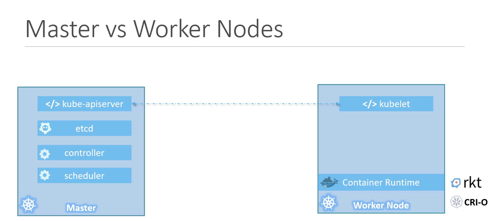
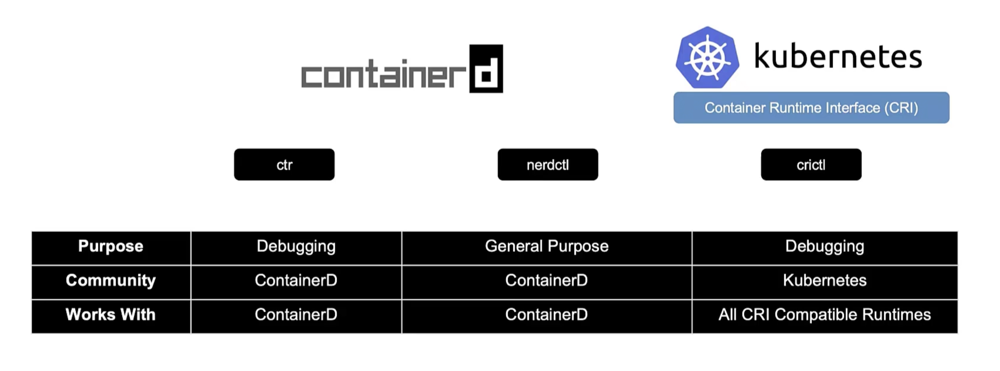

# Kubernetes

## Introduction
- Use of container and cloud is on the rise across the industry, and across platforms Kubernetes is supported.
- Kubernetes aka k8s also has certification divided into two part administrator(advance deployment, security, maintence etc) and Application developer(for developers to design configure and deploy cloud native application, this should be easier).

## Overview
- k8s built by google based on their experience running containers in production now open source.Most powerful container orchestration.
- Containers : Like Dokcer container, it has base image and then your logic etc etc..
- Orchestration : Now container is created, how do you handle it in production according to different scenarios like increase of user traffic, some container going down etc etc.So we need some software/ rule to handle it.

### _The Whole process of automatically deploying and managing containers is known as container orchestration._
-K8s is one of these container orchestration technology and supported by all cloud tech like aws, gcp azure etc.Traffic is load balanced across the containers and can configure to increase decrease containers and hardware as well.

### Architecture
_Some Basic Terms_
- Node(Minions) : A machine physical or virtual on which k8s is installed.In it the container is launched by k8s.What if this machine stops, our application goes down, so we nee more than one node.
- Cluster : Set of nodes grouped together.Resulting in app still running if a node fails as well as load balancing/sharing.
- Master : One of the nodes having k8s installed configured to /acts as master, takes care of orchestration like if a node stops etc, the other nodes of cluster called worker nodes.

_When installing k8s, you are actually installing following components_
- API Server : Acts as UI, commands , user instructions flow through this.
- etcd(Key - Value Store) : Stores info about the cluster and master and workers.
- Scheduler : Assigning containers to nodes.
- Controller : Brains behind orchestration, responsible for noticing and responding when, nodes, containers or end point goes down.May decide to bring up new containers.
- Container Runtime : Underlying s/w that is used to run containers.(Docker)
- kubelet : Agent that runs on each worker node in the cluster.makes sure container on each node running as expected.Master has kube-apiserver running.



- kubectl (kubeControl or command line) : Used to run and deploy k8s cluster.
- kubectl run .... // to deploy application in a cluster
- kubectl run nginx --image=nginx //sample run of nginx
- kubectl cluster-info
- kubectl get nodes //get all nodes of the cluster

### Docker-vs-ContainerD
- Earlier k8s was used only for docker and these 2 were used together, now other container runtime like rocket etc want to associate with k8s.
So k8s introduced CRI(Container Runtime Interface), it allows any container runtime to be used as long as it follows OCI standards.
- OCI Standard :
    - imagespec : how image should be build
    - runtimespec : how container should run
 - Docker still was built very earlier so didn't follow OCI standard.
 So k8s still support docker but containerD which was part of dockercan be installed separately and it is OCI compatable so can be used, so now we can use containerD and may not install docker as well to work with k8s.
 - containerD has default cli tool(ctr) but not vey useful, so we can install nerdctl cli tool which acts just as we were using docker in commands
 nerdctl === docker
- crictl cli for cri.
 

 ### PODS
 - k8s uses yaml file to create all of various objects of k8s
 pod-definition.yml
 ```
    apiVersion: v1 //various other version possible
    kind: Pod //kind of object we are trying to create, this is pod yml
    metadata: //data about the object like name, labels etc., this is dict
        name: myapp-pod
        labels:
            app: myapp
            type: front-end
    spec: //depends on what you are trying to create
        containers: //list of containers can have more
            -name: nginx-container
             image: nginx
 ```
 ^ Must have properties
 ```
    kubectl create -f pod-definition.yml // to create pod from the above file, create/apply can also be used
    
    kubectl get pods // to see list of pods available

    kubectl describe pod "podName" //to get info about the pod
 ```

 ### Replication Controllers and ReplicaSets
 - Controller are the brain behinf k8s, and Replica is one of the controller
 - Replica insures according to our condition to maintain x number of replicas of pods, and when a pods go down bringback another replica up even when there is single pod.
 - replica controller is now replaced by replica set, both do above basic task.

>ReplicationControllerDefinition.yml
 ```
    apiVersion: v1 
    kind: ReplicationController 
    metadata:
        name: myapp-rc 
        labels:
            app: myapp 
            type: front -end
    spec:
        template:
            metadata:
                name: myapp-pod 
                labels:
                    app: myapp 
                    type: front-end
            spec:
                containers:
                    - name: nginx-container 
                    image: nginx
        replicas: 3

 ```

 >ReplicationSetsDefinition.yml
 ```
    apiVersion: apps/v1 //change from earlier
    kind: ReplicaSet //change
    metadata:
        name: myapp-replicaset 
        labels:
            app: myapp 
            type: front -end
    spec:
        template:
            metadata:
                name: myapp-pod 
                labels:
                    app: myapp 
                    type: front-end
            spec:
                containers:
                    - name: nginx-container 
                    image: nginx
        replicas: 3
        selector:  //change, will take older pods in cosideration too, must
            matchLabels: 
                type: front-end //and many other criteria

 ```
- to scale the pods replace replicas with updated number and use 

>kubectl replace -f ReplicationSetsDefinition.yml
or

>kubectl scale --replicas = newNum -f ReplicationSetsDefinition.yml
//will not update in file
 ```
    kubectl get replicacontroller

    kubectl get replicaset
    //to get the info
 ```
 >delete replicaset command will delete replicaset along with all pod

 ### Deployments
 - In Prod need many instances, and way to upgrade them according to updated.
 - Update is done by rolling, updating one by one pods.
 - And various other utilities are available with k8s pods.
 - Deployment(an object of k8s) engulfes replica set hich engulfes pods which has containers.
- In above replicaset command just set kind to kind: Deployment, and can deploy this, automatically create a replicaset for it.

```
kubectl get all // gives all objects
```

#### RollOut and Update and RollBack
- When you first create a Deployment it creates a Roll Out, and each roll out will have a version say v1, v2 and so on.
- This helps to track status of roll out and if wanted to revert to that particular revision
```
kubectl rollout status deploymentName // to know rollOut status

kubectl rollout history deploymentName // will show history and revsions
```
- Update Deployment can be done by stopping all pods at once and then deploying all(Not default not good, called recreate), or by doing one by one so others are still available(called rolling update, good, default)

- when doing update deployment create another replicaset which create newer version pods and the older replica set keep on destroyinh it's pods.

- kubectl rollout undo deploymentName // to return to older version

- To update anything just do changes to your deployment yaml file and then use
```
kubectl apply -f deploy.yaml
```

better to change in file rather than applying tags as it doesn't get applied in the file.

#### Networking
- IP addresses are assigned to each pods in k8s whereas in docker it is assigned to a container.
- When k8s is installed it blocks a range of ip for itself to deploy pods.
- Not a good idea to communicate between pods with this ip as they are subject to change whenever pods goes down due to update or any other reson
- k8s expect us to setup a network, many pre build helper tools are available are cisco, flannel,cilium,calico etc
- Above setup can help to commmunicate inter nodes and enabling communication between all pods

### K8s Services
- Services enables communication between various parts of our deployed system and others too like users, any db etc.
- K8s Service is an  k8s object just like deployment, replica set etc
- Service Types
1. NodePort
2. ClusterIP
3. LoadBalancer

#### NodePort
- To allow communication from a Node's port to the port of pod running and various other components of microservices.
- looking similar ot docker -p command which attaches a port of our machine to the pod's port.
- here kind willl be Service in yaml.
- spec:
    type: NodePort
    ports:
        - targetPort: 80
          port: 80
          nodePort: 30008
- if there are many pods of same type all are attached, acting like load balancer.

#### ClusterIP
- our deplloyed application have various parts like front-end, back-end etc so helps in creating a generic ip for it so that can be then communicated to which will have all pods, so that cluster ip can be used even when pods go down or increased decresed etc.

#### LoadBalancer
- Various cloud resources provide this, specifaclly for cloud platform.


### K8s On Cloud
- In self hosted solutions you have to take care of vms and it's maintainance.
- In cloud services this is taken care of along with various other benefits for easier implementation.
- in yaml specification use load balancer as type for cloud k8s deployment.
- Various cloud platform services
    - GCP(GKE service for K8s)
    - AWS(EKS service)
    - AZURE(AKS)

