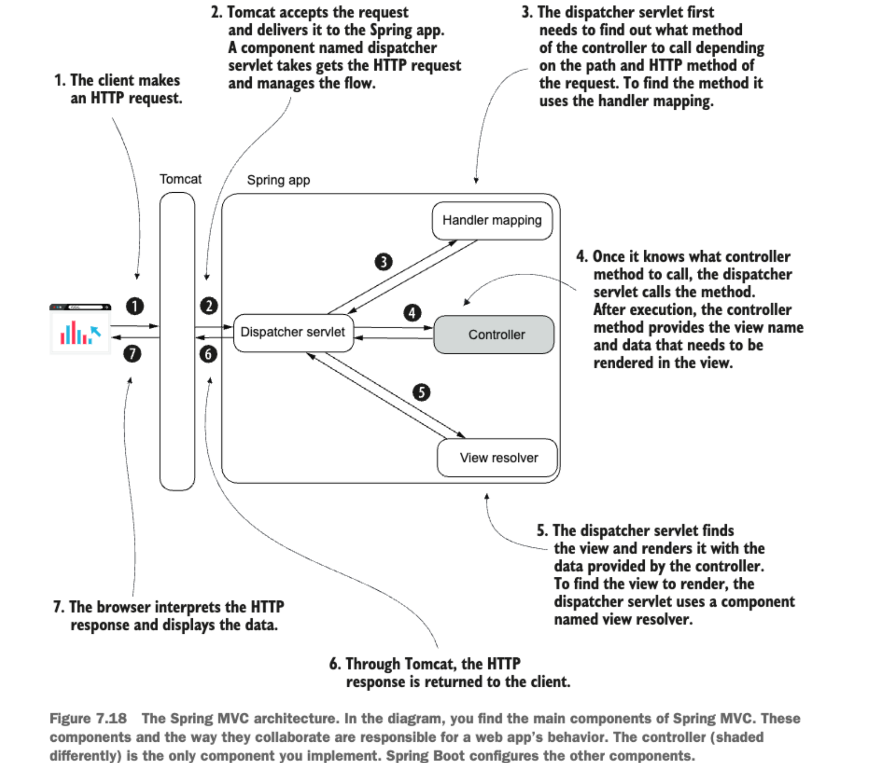
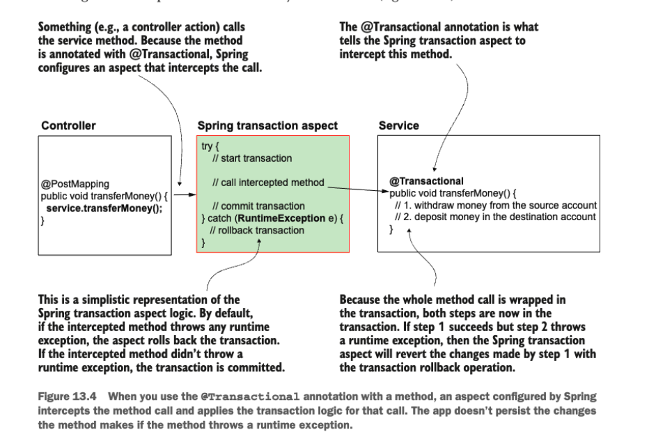
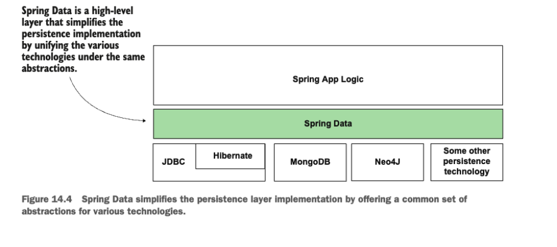
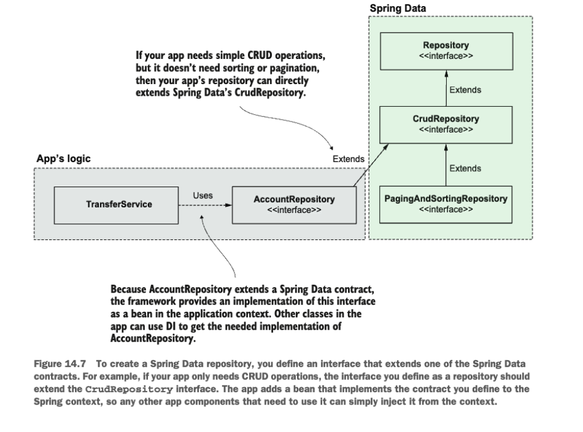

## Chapter 1
- Application Framework is a set of common software functionalities that provides a foundational structure for developing an application
- Imagine spring as a DIY furniture from IKEA
- Spring is not simply a framework but an ecosystem with various framework in it like for data access, core, mvc etc, with Spring Core being the foundation/sun of this ecosystem
- Spring works on basis of Inversion of Control i.e. instead of application controlling the execution, it's done by some other peince in here spring

## Chapter 2
### Maven
- Maven, gradle are some of the build tools used along with java projects(spring as well) for maintaining dependecy and it's versions, running tests, compiling, packaging, security vulnerabilities etc. `pom.xml` has seeting and dependecies info of your project. You create a project in maven with following details
    - groupId(company etc)
    - artifactId(current projectName etc)
    - version(current version)
- By default maven download library from maven central but you can change that according to usage

### Adding Beans to Spring Context
- Bean in Spring means object instance that are created and managed by Spring
- Spring provides three primary ways to register beans in the IoC container: 
    - Using @Bean annotation
    - Using Stereotype annotations
    - Programmatically

| Method               | Use Case                          | Control Level | Auto-Discovery? | Best Practice |
|----------------------|-----------------------------------|---------------|-----------------|---------------|
| **`@Bean`**          | Third-party libraries, complex initialization | High | No (explicit) | Use for external dependencies where you need custom initialization logic |
| **Stereotype** (`@Component`, `@Service`, etc.) | Application-owned classes | Medium | Yes (via `@ComponentScan`) | Default choice for your own services, repositories, and controllers |
| **Programmatic** (via `BeanFactory`/`ApplicationContext`) | Dynamic/runtime bean registration | Very High | No (manual) | Reserve for advanced cases like plugin systems or conditional registration |

## Key Recommendations

1. **Prefer stereotype annotations** (`@Component`, `@Service`, etc.) for:
   - Your own application classes
   - When you want automatic detection and DI

2. **Use `@Bean` in `@Configuration` classes when:**
   - Working with third-party libraries
   - Need custom initialization logic
   - Require method-based bean definition

3. **Use programmatic registration only for:**
   - Runtime-determined beans
   - Framework extensions
   - Cases where annotations aren't flexible enough

## Examples
### `@Bean` Method
```java
@Configuration
public class AppConfig {
    @Bean
    public DataSource dataSource() {
        return new HikariDataSource(...);
    }
    //the method name is also by default bean name , so keep it a noun instead of general convention of keeping method name as a verb
}

//then in main class to get bean, also other place autoWired/constructor
var context = new AnnotationConfigApplicationContext(AppConfig.class);

        DataSource myDataObject = context.getBean(DataSource.class);
```
### Stereotype Annotation
```java

@Service
public class UserService {
    // business logic
}
```

### Programmatic Registration
```java
var context = new AnnotationConfigApplicationContext();
context.registerBean(MyDynamicBean.class, () -> createBeanBasedOnRuntimeConditions());
context.refresh();
```
- spring-context dependecy is added in pom.xml for using spring context and add beans into it

#### Adding more than one object of the same type
- According to the config method name bean name will be different and then can access same type object with different name
```java
Parrot p = context.getBean("beanName", Parrot.class); // by simply giving classType with more than one object of the same class type you will get exception so need to give name as well
```
- can give bean particular name instead of default by mehtod name by @Bean(name ="someNameGivenToBean")
- Can define a bean as @Primary so it will be chosen over other beans of the same type if name is not given, and for one types of bean only one can be primary

### Using StereoType annotations to add Beans in Spring Context
- Mark @Componenet over the class whose object you want to be registered in spring context
- Need to mark in configuration class, @ComponentScan(basePackages = "fileLocation") to find the files where component etc is present
- can add @PostContruct over a method in class to do some functioning after a contructor is hit

### Programatically Adding Beans
- You can register some bean based on some condition etc in program in context using registerBean etc method of context
- No need of config class or some @ over the java class

## Chapter 3
### Establish Relationship Among Beans
- We have two ways
    - Wiring(directly calling some method etc for getting bean)
    - Auto-Wiring(Spring attaches the bean,cconstructor injection etc)
#### Wiring
```java
@Bean
  public Parrot parrot() {
    Parrot p = new Parrot();
    p.setName("Koko");
    return p;
  }

  @Bean
  public Person person() {
    Person p = new Person();
    p.setName("Ella");
    p.setParrot(parrot());//getting bean from above
    return p;
  }
//Spring is smart enough to return bean os present or create if not present, no double object creation

@Bean
  public Person person(Parrot parrot)//Spring Injecting i.e. DI
   {
    Person p = new Person();
    p.setName("Ella");
    p.setParrot(parrot);
    return p;
  }//this also works , direct bean objectTypeReferencePassed not calling methos
```
> Dependecy Injection(IoC principle) is a technique involving the framework setting the value into specified field or parameter
### Auto-Wiring
- Using @Autowired
- There are three Ways of using autowire
#### 1. Using @Autowired to inject the values through the class fields(usually find in examples and POCs)
```java
public class Person {

  private String name = "Ella";

  @Autowired
  private Parrot parrot; //basically this

  //getters settters etc
}
```
- not highly recommended for prod code, as can't make injected values final so they can be changed creating issues

#### 2. Using @Autowired to Inject the values through the contructor
- Most often used in prod code and recommended
```java
@Component
public class Person {

  private String name = "Ella";

  private final Parrot parrot; //can make final so better

  //    @Autowired //optional
  public Person(Parrot parrot) {
    this.parrot = parrot;
  }
  .......
  .......
}
```
#### 3. Using DI through the setter
- This is a possibility but more disadvantages rather than advantages
```java
@Component
public class Person {

  private String name = "Ella";
    .....
    .....
  @Autowired
  public void setParrot(Parrot parrot) {
    this.parrot = parrot;
  }
}
```

### Circular Dependecy
- Basically a deadlock, Bean A needs bean B and Bean B needs Bean A to be created
- Need to read logs/exception and redesign code

### Choosing from Multiple Beans in the Spring Context
- Parameter Name matches the bean name/method name(avoid relying on name, use qualifier for better understading)
- if name not matches
    - If some bean is marked @Primary
    - @Qualifier and give some particular name
    - if none is primary and no qualifier the gives an exception

## Chapter 4(Spring Context : Using Abstractions)
- We use interface for loose coupling and making sure can do changes in future
- Like previously we were injecting objects, spring also understand abstractions i.e can inject object if there is an ask for interface that object is implementating
- So can inject using contructor , setter methods or beans etc
- And if you have various Beans/Componenets of the same type you can prefer one or another to use currently by just mentioning over something as primary or using Qualifier(name = "?")
- @Service and @Repository are other stereotype tags similar as Component
- They all mean the same adding an instance to the spring context of the class over which they are annotiated

## Chapter 5(Spring Context : Bean Scopes and Life Cycle)
- Spring has multiple different approaches for creating beans and managing lifecycle, and in Spring these are called as scopes
- Singleton Bean scope is the default bean scope in spring , so one instance
- If bean have different name then for same type we can have many number of beans, in Spring SingleTon means unique per Name not type. So @Bean in configuration class , give different name so can have many beans for same type
- Keep bean immutable if want it to be singleton, so constructor injection final field
- By Default bean scope being singleton , it's default behavior is eager initialisation
- During Lazy initialisation instaces are created only when they are referenced, use @Lazy over stereotype annotated class/ or over @Bean
- By default eager is better to be used, but some cases can be for lazy usage
- Prototype scope everytime a bean/object is referenced a new bean is created, use @Scope(BeanDefinition_SCOPE.PROTOTYPE) over the @Bean , or over stereotype annotation , so prototype no issue do mutation, no race condition

## Chapter 6(Using Aspects with Spring AOP)
- Aspects are a way framework intercept method calls and possibly alters the execution of methods, called AoP(Aspect oriented Programming)
- Various capibilities of spring uses aspects like trasactionility and security configs
- When designing an aspect, you define the following
    - Code to be excuted, the `aspect`
    - when the app should execute this logic aspect, `advice`
    - which methods can framework intercept , `pointcut`
- to enable aspect working by framework on the object, the context had to be made aware about it, i.e. spring cotext should have object registered as bean(called the target object)
- Spring manages Aspect object and enhaces it and when you access it you get it's `Proxy` an enhanced object with properties/methods attached for Aspect
- Steps to Enable AoP
  - Need spring-aspects depencdency along with in both spring or springboot(spring boot starter aop)
  - @EnableAspectJAutoProxy over the config class to enable aspect mechanism
  - Create a class, mark with @Aspect(not a steretype so need to create bean), and make a bean of it(either with @Bean or with a stereotype) 
  - Define a method in @Aspect amrked class and telling it when and where to implement aspect
  - Implement aspect logic
  - ```java
      @Around("execution(* services.*.*(..))")//when and where i.e. advice
      public void log(ProceedingJoinPoint joinPoint) throws Throwable {
       /* logger.info("Method will execute");
        joinPoint.proceed();//calls intercepted method, if not present intented method won't be called
        logger.info("Method executed"); //logic
        */
      }
    ```
- ProceedingJoinPoint can help you get various info regarding the method, return type , objects etc
- Aspects has much more powerful usages such as changing the return type, changing the values of parameter, throwing an eception to caller or catching an exception from called method
- Use aspects carefully as you may start to hide important details/changes in aspect creating issues in later logic building/understanding
- Instead of using an expression for when and where to execute the apsects you can use custom tag build and `@Around("@annotation(ourAnnotationUsedForAspectMakringonMethods)")`
```java
@Retention(RetentionPolicy.RUNTIME)
@Target(ElementType.METHOD)
public @interface ToLog {
}
```
- @Around covers all things like before , after, inbetween etc but there are other advice annotation as well like before, afterReturning, AfterThrowing, After can be used as well, so in other you won't get ProceedingJoinPoint to be enable to call methos according to your choice
- Usually in real world we have aspects working over aspects so what flow it follows then?
  - By default spring doen't maintain order so if order is not relevant let framework execute them
  - If order is relevant @Order(number) over the Aspect class, the lower the number , earlier the execution


## Chapter 7(Understanding Spring Boot and Spring MVC)
- Earlier there were desktop apps for everything but now there are web apps for everything, so any device connected over internet can attempt to use it
- WebApp has two parts, Frontend/client side and BackEnd/Server side. Client send request and Server respons to it appropriatly.Backend can directly send the view along with data to be displayed or only the data , that can be used either by some other view mechanism or direct consuming
- Big apps usually have a separation for Frontend view and backedn server logic
- Browser uses and understands HTTP protocol to communicate over the network , so most applications uses HTTP
- Servlet container/webServer helps trasnslate HTTP request to java app and vice versa, by default TomCAt is used in Spring Boot but there are other server present as well
- Spring/Spring boot helps us to create servlets which is then added to this servlet container/webServer to be allowed to be serve requests
- Simple Spring web app needed to have many configurations which are drastically reduced in spring Boot
- Spring Boot specially helpful in SoA(Service Oriented Architecture) and MicroServices. Spring Boot Helps with 
  - Simplified project creation(Spring initializr and other IDE support)
  - Dependency Starters
  - AutoConfiguration Based on Dependecy
- Spring Initlialzr configures following things in your project
  - The Spring app main class
    ```java
    @SpringBootApplication
    public class Main {

      public static void main(String[] args) {
        SpringApplication.run(Main.class, args);
      }

    }
    ```
  - The Spring Boot POM Parent : provides compatible dependency version of many other dependency being used according to parent version. It's Recommended to get any dependecy version through Parent rather than manually getting it
    ```xml
    <parent>
          <groupId>org.springframework.boot</groupId>
          <artifactId>spring-boot-starter-parent</artifactId>
          <version>2.5.1</version>
          <relativePath/> <!-- lookup parent from repository -->
      </parent>
    ```
  - The Dependecies : all depndecy you manually added will be shown in pom.xml
  - The Spring Boot Maven Plugin : Usually at end of pom.xml file
    ```xml
    <build>
          <plugins>
              <plugin>
                  <groupId>org.springframework.boot</groupId>
                  <artifactId>spring-boot-maven-plugin</artifactId>
              </plugin>
          </plugins>
      </build>
    ```
  - The Properties File : initlially empty will contains various infos and can be different for each environment as well
- spring-boot-starter-`x` , spring boot has various starter dependecy which can be used for quick working and less configuring, x == web is the one for creating RestApi and web app, without dependecy starters you will have to know all dependecy and their compatible verisons, we has AoP, tomcat , spring context and other JAR libs exported
- AutoConfiguraton : convention-over-configuration principal, so do config how majorly it's being used so user has to make less configs and can focus on logic more
- In resources/static you can have your web pages and can create a @Controller(Stereotype) class with a method returning this web page by the name, and over the method @RequestMapping("/home"), so /home will trigger the method and return the page that you mentioned, default port of start is 8080 for spring boot



## Chapter 8(More Spring boot and MVC)
- With the help of template engine, thymeleaf(starter-thymeleaf), JSP etc can edit content before sending view to make our webpage modern
- static contect in resource/static and templates in resource/templates so thymeleaf ones will go into templates one
- So need data to be flown from frontend/user to backend so that our template engine can use it and replace values
  - Request Parameter : key-value pair , `uri?key=value&key2=value2...`, `@RequestParam`
    - simple way, often used in prod
    - quantity of data is small, approx limit is 2,000 characters
    - need to send optional data, when data is not always present
    - often used in some search, filter criteria
    - after path you have a question mark ? marking start of key/value pairs and and pairs are separated by &
    - mandatory by default, send HTTP 400 Bad Request if not present, @RequestParam(required = false) for making param optional
  - Path Variables : gets directly set in path `path/variable1/variable2....`, `@PathVariable Type pathVarName`
    - so no keys, can have more that one varaibles, but bette to limit to to couple
    - don't use for optional values
    - easier for indexing with browser for searching, saving and understading 
    - need to mark varible name in path of controller and use same name with @PathVariable, 
  - HTTP headers, can't send much large info, and don''t appear in path
  - Request Body , sending like an object
- There are different type of HTTP methods, and same path with different method type can be there doing different thing as it should
  - GET : Read only data
  - POST : New data to be added
  - PUT(Idempotent) : Change a data record
  - PATCH(not idempotent) : Partially change a data record
  - DELETE : delte a record 
- Instead of using @ReqeustMapping(httpRequestType) , can use @GetMapping, @DeleteMapping and other respect type to mark a paricular controller HTTP mehtod type easily, can add direct instace in request as well, spring will auto assign values from request to object type

## Chapter 9 (Using the Spring Web Scopes)
- Already seen bean scope of singleton and prototype
- There are other particular to web , called web scopes such as 
  - Request scope(@RequestScope) : Creates a bean for every HTTP request
  - Session scope(@SessionScope) : Bean for an entire session, links bean instance with client session useful for keeping logged in for a session , shopping cart etc
  - Application Scope : Unique in app's context, available until application is running
- Avoid using Session and Application scope as it makes your service stateful

## Chapter 10 (Implementing REST Services)
- REST endpoint can be a point of communication between any device to our endpoint , even between two services as well
- REST for spring/spring boot is similar what we did for sending view but instead here we will be sending json type response no views, so no view resolver.@ResponseBody over @Controller tells the controller to now look/send view intead send some HTTP response(JSON etc), ResponseBody can be put over individual method as well. Can Give @RestController over the controller for making all methods return responseBody type
- REST endpoint communication issues
  - Response takes time, so HTTP request might time out and break communication
  - Sending large amout of data(few MB) may break communciation
  - Too many concurrent calls may break the app
  - Communication over network may fail due to n number of reason for trouble in network
- Can hit/test endponts with cUrl./PostMan etc tools
- Sending the HTTP Response, it has 3 data
  - Response Headers  
  - Response Body(DTO(Data Transfer Objects))
    - when you send objects or collections , in rest it auto converts into JSON objects(can send other type as well but usually it's json)
  - Response Status
    - by default spring send some default status like 200 if no exception hit, 404 if request endpoint not found, 400 bad request, 500 server error
- Can use ResponseEntity for setting headers , status and body. Also can set values according to if any exception is raised
    ```java
    ResponseEntity
            .status(HttpStatus.ACCEPTED)
            .header("continent", "Europe")
            .header("capital", "Paris")
            .header("favorite_food", "cheese and wine")
            .body(c);
    ```   
- Better way to handle excpetion in controller is through @RestControllerAdvice(@ControllerAdvice + @ResponseBody like controller and rest controller) and also @ExceptionHandler over the method and also can mention the type of excpetion to handle with particular method
```java
@RestControllerAdvice
public class ExceptionControllerAdvice {

  @ExceptionHandler(NotEnoughMoneyException.class)
  public ResponseEntity<ErrorDetails> exceptionNotEnoughMoneyHandler() {
    ErrorDetails errorDetails = new ErrorDetails();
    errorDetails.setMessage("Not enough money to make the payment.");
    return ResponseEntity
        .badRequest()
        .body(errorDetails);
  }
}
```
- @RequestBody varType varName in controller to recieve objects from client which can be used in spring boot(@RequestHeader Type name for recieving header)

## Chapter 11(Consuming REST Endpoints)
- Ways to call RestEndpoint from a Spring App
  - OpenFeign
  - RestTemplate
  - WebClient
  - in book these 3 other way/combo are also present, see below table

| Client Option       | Type          | Sync/Async | Spring Integration | Resilience Features | Ease of Use | Best For                          |
|---------------------|---------------|------------|--------------------|----------------------|-------------|-----------------------------------|
| **RestTemplate** (Deprecated) | Imperative    | Sync       | ✅ Native           | ❌ Manual             | ⭐⭐⭐        | Legacy apps, simple sync calls    |
| **WebClient**       | Reactive      | Async      | ✅ Native           | ✅ Retry, timeouts   | ⭐⭐⭐⭐       | Reactive apps, non-blocking calls |
| **OpenFeign**       | Declarative   | Sync       | ✅ (Spring Cloud)   | ✅ Circuit breakers  | ⭐⭐⭐⭐       | Microservices, typed clients      |
| **RestClient** (Spring 6.1+) | Imperative | Sync       | ✅ Native           | ✅ Retry             | ⭐⭐⭐⭐       | Modern sync replacements for `RestTemplate` |
| **Java HttpClient** (JDK 11+) | Imperative/Reactive | Both | ❌ Standalone      | ❌ Manual             | ⭐⭐         | Non-Spring apps, JDK-only setups  |
| **Retrofit**        | Declarative   | Both       | ❌ (Third-party)    | ✅ Plugins           | ⭐⭐⭐        | Android/Java, typed APIs          |

1. **RestTemplate**  
   - ✅ Built into Spring  
   - ❌ Deprecated (use `RestClient` or `WebClient`)  
   - Example:  
     ```java
     String result = new RestTemplate().getForObject(url, String.class);
     ```

2. **WebClient**  
   - ✅ Non-blocking, supports streaming  
   - Example:  
     ```java
     Mono<String> result = WebClient.create().get().uri(url).retrieve().bodyToMono(String.class);
     ```

3. **OpenFeign**  
   - ✅ Declarative interfaces (no impl needed)  
   - Requires `spring-cloud-starter-openfeign`  
   - Example:  
     ```java
     @FeignClient(name = "api-client", url = "https://api.example.com")  
     public interface ApiClient {  
         @GetMapping("/data") String getData();  
     }  
     ```

4. **RestClient**  
   - ✅ Replacement for `RestTemplate`  
   - Example:  
     ```java
     String result = RestClient.create().get().uri(url).retrieve().body(String.class);
     ```

5. **Java HttpClient**  
   - ✅ No Spring dependency  
   - Example (async):  
     ```java
     HttpClient.newHttpClient().sendAsync(request, BodyHandlers.ofString());
     ```

6. **Retrofit**  
   - ✅ Popular for Android  
   - Example:  
     ```java
     @GET("/data") Call<String> getData();
     ```
- retrofit toh nahi suna , ye nahi baki sb theek hain, aur restclient/openFeign(kar skte async use of completableFuture etc se) use karo sync communciation ke liye , aur web client async ke liye
- we usually define feign , etc service to call in proxy folder which mean these are ways to hit another service
- `OpenFeign(Part of Spring Cloud)`
  - recommended for any new service creation
  - ```xml
    <dependency>
            <groupId>org.springframework.cloud</groupId>
            <artifactId>spring-cloud-starter-openfeign</artifactId>
    </dependency>
    <!-- dependecy to be added for using openFeign -->
    ```
  - need to write interfaces(OpenFeign Clients)
    ```java

      //someInterface in preferrably proxy folder
      @FeignClient(name = "payments", url = "${name.service.url}")//making it feign client by giving any name and url where the client is running for hitting
      public interface PaymentsProxy {
        @PostMapping("/payment")//this is endpoint to be hit on client service
        Payment createPayment(
            @RequestHeader String requestId,
            @RequestBody Payment payment);// the params REST endpoint will be taking
      }

      //in anyConfigFile
      @EnableFeignClients(basePackages = "com.example.proxy") //over config file with package mentioning where it will find the feignClients

      //in Controller etc, from where the methods needs to be called
      private final PaymentsProxy paymentsProxy;//this is our feignClientProxy

      public PaymentsController(PaymentsProxy paymentsProxy) {
        this.paymentsProxy = paymentsProxy;//inject fgeign bean
      }

      @PostMapping("/payment")
      public Payment createPayment(
          @RequestBody Payment payment
          ) {
        String requestId = UUID.randomUUID().toString();
        return paymentsProxy.createPayment(requestId, payment);//calling feignCleintEndpoint
      }
    ```
  - can define method same like in controller like get, put,delete etc accoridngly present in client for communication along with params it will be taking
- `Using RestTemplate`(Now being depracted, RestCleint introduced from Spring 6+ but still being used mainly)
  - Depracted not due to any issue but due to advancement in REST APIs and need way to implementing various features such as calling sync and async endpoints, less boilerplate code for calling and exception handling, retry call and fallback mechanisms
  ```java
  public Payment createPayment(Payment payment) {
    String uri = paymentsServiceUrl + "/payment";

    HttpHeaders headers = new HttpHeaders();
    headers.add("requestId", UUID.randomUUID().toString());//need to create headers separatly

    HttpEntity<Payment> httpEntity = new HttpEntity<>(payment, headers);//need to create entity with java objects and headers

    ResponseEntity<Payment> response =
        rest.exchange(uri,
            HttpMethod.POST,
            httpEntity,
            Payment.class);

    return response.getBody();
  }
  ```
- Using WebClient
  - Built for reactive approach, thread doen't get blocked while waiting for response
  - Need dependecy WebFlux, spring-boot-starter-webflux
    ```java
    @Bean
    public WebClient webClient() {
      return WebClient.builder().build();
    }

    //actual calls, use mono etc flux
    public Mono<Payment> createPayment(String requestId, Payment payment) {
    return webClient.post()
              .uri(url + "/payment")
              .header("requestId", requestId)
              .body(Mono.just(payment), Payment.class)
              .retrieve()
              .bodyToMono(Payment.class);
    }
    ```

## Chapter 12 (Using Data Sources with Spring)
- Data Source : Data source manages the connetion to DBMS
  - Data source uses JDBC Driver to connect with DBMS
-  Each time requesting for a new connection slows down prod by a lot, so Data source makes sure new connections are created only when it's needed
- Using JDBC driver and doing 7 steps to connect and executing steps involving checking jdbc driver,getting connection etc is too much time taking as it involves new connection and autheticating again and again
- `HikariCP` is the most famous and default data source implementation, 
### Using JDBCTemplate to work with DB
- It is simplest of the tools spring offers to connect with DB. No other dependecy/framework needed, good for small and concise operation
- We need JDBC driver to work with any DB(if using H2 in memory then it's driver comes along with it's dependecy)
- Any code related to querying DB is added in Repository folder/package with class inside it
```xml
<!-- dependecy added for jdbcTempalte , add othe driver db accoridng to usage -->
<dependency>
    <groupId>org.springframework.boot</groupId>
    <artifactId>spring-boot-starter-jdbc</artifactId>
</dependency>
```
- inside resources folder you can add some .sql query to be executed after your connection with db, usually table creation etc are given here.(recommended to use FlyWay/LiquiBase for DB versioning)
- Use `BigDecimal` instead of double or float for saving data related to prices etc which uses decimal , double or float loses decimal accuracy
- We make respository a Bean with @Repository(Stereotype annotation), which can be used in controller/service class for calling the methods from that bean
- Spring boot auto creates bean for JDBCTempalte which can be injected into repo, to be used for querying DB
```java
public class PurchaseRepository {

  private final JdbcTemplate jdbc;

  public PurchaseRepository(JdbcTemplate jdbc) {//spring boot provide this
    this.jdbc = jdbc;
  }

  public void storePurchase(Purchase purchase) {
    String sql = "INSERT INTO purchase VALUES (NULL, ?, ?)";
    jdbc.update(sql, purchase.getProduct(), purchase.getPrice());
  }//using jdbcTemplate update method etc for executing SQL

  public List<Purchase> findAllPurchases() {
    String sql = "SELECT * FROM purchase";

    RowMapper<Purchase> purchaseRowMapper = (r, i) -> {
      Purchase rowObject = new Purchase();
      rowObject.setId(r.getInt("id"));
      rowObject.setProduct(r.getString("product"));
      rowObject.setPrice(r.getBigDecimal("price"));
      return rowObject;
    };

    return jdbc.query(sql, purchaseRowMapper);//using rowMapper
  }
}
```

- Need to use RowMapper to transform ResultSet into Java Objects
- Updating config for DB Connection, now Spring Boot will create Datasource according to data present in properties file
  ```properties
  spring.datasource.url=jdbc:mysql://localhost/spring_quickly
  spring.datasource.username=root
  spring.datasource.password= //not good idea to store password here
  ```
- In many cases you need to yourself create DataSource Bean instead of auto creation by Spring Boot, in cases like
  - You need to use a specific DataSource implementation based on a condition you can only get at runtime.
  - Your app connects to more than one database, so you have to create multiple data sources and distinguish them using qualifiers.
  - You have to configure specific parameters of the Datasource object in certain conditions your app has only at runtime. For example, depending on the environment where you start the app, you want to have more or fewer connections in the connection pool for performance optimizations.
  - Your app uses Spring framework but not Spring Boot.
  ```java
  //Sample Bean Creation , can add conditions
  @Configuration
  public class ProjectConfig {

    @Value("${custom.datasource.url}")//fetching from properties file, so can create different props file according to environment
    private String datasourceUrl;

    @Value("${custom.datasource.username}")
    private String datasourceUsername;

    @Value("${custom.datasource.password}")
    private String datasourcePassword;

    @Bean
    public DataSource dataSource() {
      HikariDataSource dataSource = new HikariDataSource();
      dataSource.setJdbcUrl(datasourceUrl);
      dataSource.setUsername(datasourceUsername);
      dataSource.setPassword(datasourcePassword);
      dataSource.setConnectionTimeout(1000);
      return dataSource;
    }
  }//Data source is important
  ```
- Can create more than one JDBCTemplate/Data source then you 

## Chapter 13(Using Transactions in Spring Apps)
- Transaction are important part of managing data accurately
- In Spring Trasanction uses Aspects, and mark @Transactional ovet the method using transaction(or even over class so all methods becomes a transaction), and spring add aspect behind it

- always throw exception from transactional marked method so the aspect know something went wrong , if you catch it in the method itseld it will commit the transaction without any issue
```text
<!-- ni smjh aaya -->
What about checked exceptions in transactions?
Thus far, I've only discussed runtime exceptions. But what about the checked excep. tions? Checked exceptions in Java are those exceptions you have to treat or throw; otherwise, your app won't compile. Do they also cause a transaction rollback if a method throws them? By default, no! Spring's default behavior is only to roll back a transaction when it encounters a runtime exception. This is how you'll find transactions used in almost all real-world scenarios.
When you work with a checked exception, you have to add the "throws" clause in the method signature; otherwise, your code won't compile, so you always know when your logic could throw such an exception. For this reason, a situation represented with a checked exception is not an issue that could cause data inconsistency, but is instead a controlled scenario that should be managed by the logic the developer implements.
If, however, you'd like Spring to also roll back transactions for checked exceptions, you can alter Spring's default behavior. The @Transactional annotation, which you'll learn to use in section 13.3, has attributes for defining which exceptions you want Spring to roll back the transactions for.
However, I recommend you always keep your application simple and, unless needed, rely on the framework's default behavior.
```
- No need for any extra dependecy for trasanctional, if have added any starter related to data/jdbc
- (Added notes about transaction in DB notes, naserHusseing Udemy)

## Chapter 14(Implementing Data Persistence Using Spring Data)
- JDBC offeres direct way of using Statements, connection etc for handling connection with DB, Spring DATA offeres much more efficient handling with ORM and OTHER things for more simplicity and keeping similar way for using DB with different types so don't have to write syntax for others

- Spring Data is not one dependency but a group and you can choose one or more among them according to your usage, like Spring Data Mongo, Spring Data JDBC etc
- Spring Data Provides a common sets of interface(Contracts) to define app's persistence capabilities
  - Repository : No predefined methods but mark it data repo(Different from stereotype @Repository)
  - CrudRepository : simplest data contract, simplest CRUD operations
  - PagingAndSortingRepository : along with crud adds operation for sorting and getting chunks of record/paging
  ```java
  //usage
  public interface AccountRepository extends CrudRepository<Account, Long> {
    //we get many methods bu can add oura as well
    @Query("SELECT * FROM account WHERE name = :name")
    List<Account> findAccountsByName(String name);

    @Modifying//meaning this is nott jsut read, some data will change
    @Query("UPDATE account SET amount = :amount WHERE id = :id")
    void changeAmount(long id, BigDecimal amount);
    
  }
  ```
- Spring DATA JPA provides JPA repo which is more particular than PagingAndSortingRepo and uses Hiberanate etc ORM which implement JPA specification, Soring Data Mongo provide MongoRepository

- Spring Data JDBC provide these crud and paging repo and no ORM , spring-boot-starter-data-jdbc dependecy
- schema.sql for creating table and data.sql to add any mock data after schema.sql is triggered, need to mark primary key field as @Id, and need to give it's type in repo extention
- spring data and it's repo also provide sql query according to namingConvention used in method naming like: List<Account> findAccountsByName(String name); spring data can create this sql query automatically
- even though your repo is an interface Spring Data creates it's dynamic implementation which can be used for DI in other controller or service classes

## Chapter 15(Testing)
- There are several type of testing but in Spring boot we writes test for Unit Testing and Integration testing
- Tests makes sure the changes we make during the app's development process don't break existing capabilities(at least make errors less likely) and also serve as documentation
- Why to wrtie test
  - Can run test over and over again to check if functionality is still working as expected
  - Can understand use case and application flow by checking test 
  - Provides early feedabck on any new development work/changes
  - Can run test along with CI , to check if all thing is functioning well with tools such as Jenking and TeamCity
- Making your app maintanable means meaning your app easily testable and vice versa
- in maven project(so in spring boot as well) you write test inside test folder 
- Basically you think about various scenarios that can take place in a method and write test case about it
- Writing Unit Test
  - Unit test purpose is to validate a singlue unit of logi'c behavior
  - Any test has 3 parts
    - Assumptions : Before calling the tested method , decide the input values the method dependes on
      - In Assumption we identify the dependecies for the execution of test case, these are anything the method we are doing test on uses but doesn't create itself
      - Some dependecy like repository we have to mock, so we replace call original object with the call to mock object 
    - Call/Execution : We need to call the logic we test to validate its behavior
    - Validations : We need to define all the validation that need to be done for the given piece of logic.
    - Sometime these 3 are called as arrange,act and asset or given, when and then
  - We create a separate class for test inside test folder and mark it's method with @Test
  - Another way to do this is by using @ExtendWith(MockitoExtension.class),@Mock,
  @InjectMocks this will be sort of like bean in class
  ```java
  @Test
  @DisplayName("Test the amount is transferred from one account to another if no exception occurs.")
  public void moneyTransferHappyFlow() {
    AccountRepository accountRepository = mock(AccountRepository.class);
    TransferService transferService = new TransferService(accountRepository);
    //
    // your test
    }

  //similar as above
  @ExtendWith(MockitoExtension.class)
public class TransferServiceWithAnnotationsUnitTests {

  @Mock
  private AccountRepository accountRepository;//this is getting mocked

  @InjectMocks
  private TransferService transferService;//above mock is getting injecting in this

  //methods for testing etc

  }
  ```
- Some Integration test remain